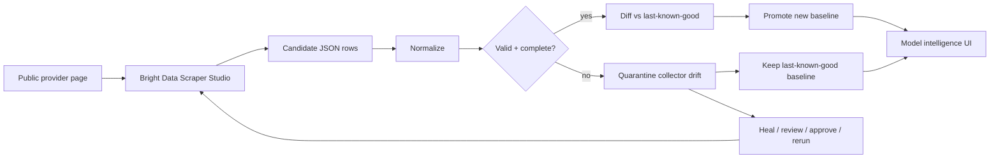

# SpecShift

**Self-healing AI model intelligence.**

SpecShift monitors public AI model and pricing pages, normalizes their data into one canonical schema, validates every candidate snapshot, detects meaningful provider changes, and surfaces collector drift before stale or malformed data reaches developers.

Built for the WeMakeDevs × Bright Data **Into the Scrape-Verse** hackathon.

- **Live app:** https://specshift.vercel.app
- **Demo:** https://www.youtube.com/watch?v=MPs1VLcVFzk
- **Version:** v0.006.3

## The problem

AI model providers change constantly: model availability, pricing, context limits, capabilities, lifecycle state, and even the structure of their documentation pages. A conventional scraper can silently break when the page changes and accidentally make malformed extraction look like a real provider update.

SpecShift separates those two events:

- **Provider intelligence changed** — valid structured data changed, so SpecShift emits a meaningful delta.
- **Collector drifted** — extraction quality degraded, so SpecShift quarantines the candidate and keeps the last-known-good baseline active.

The result is a live intelligence surface for developers and AI platform teams that need trustworthy model metadata instead of "latest scrape wins."

## What SpecShift does

SpecShift currently monitors three public provider sources through **custom Bright Data Scraper Studio collectors**:

| Provider | Public source | Purpose |
| --- | --- | --- |
| OpenAI | `https://developers.openai.com/api/docs/models` | Models, modalities, pricing/context fields when exposed, availability |
| Anthropic | `https://platform.claude.com/docs/en/about-claude/pricing` | Claude model pricing and model metadata |
| Groq | `https://console.groq.com/docs/models` | Supported models/systems, pricing where exposed, context and lifecycle |

Each provider keeps a stable Scraper Studio `c_*` Collector ID. SpecShift triggers those collectors server-side, polls Bright Data for the result, normalizes the returned rows, validates them, and only then allows a snapshot to replace the previous baseline.

## Reliability model



A successful HTTP request is not enough. Candidate data must pass schema, provenance, numeric-invariant, and completeness checks before promotion.

See [`docs/ARCHITECTURE.md`](docs/ARCHITECTURE.md) for the full trust-state and change-detection model.

## Bright Data Scraper Studio

Scraper Studio is the data-collection and repair layer at the core of SpecShift.

The project uses **custom collectors**, created and operated with the Bright Data CLI. Stable Collector IDs are injected into the server runtime through environment variables; the Bright Data API token never enters the React bundle or repository.

The server-side flow is:

1. Browser sends `POST /api/collectors/run` with a provider.
2. SpecShift triggers the provider's stable Scraper Studio collector through Bright Data.
3. Browser receives only the non-secret collection/run identifier.
4. Browser polls `/api/collectors/result`.
5. SpecShift retrieves the dataset server-side.
6. Returned rows are normalized and validated.
7. Valid candidates enter the diff engine; invalid candidates are marked as drift and quarantined.

Exact collector creation prompts, CLI commands, validation rules, and API flow are documented in [`docs/BRIGHT_DATA.md`](docs/BRIGHT_DATA.md).

## Self-healing proof

The reliability proof uses the same OpenAI Scraper Studio Collector ID throughout the recovery cycle:

```text
run → inspect defect → heal → review → approve → rerun same Collector ID
```

The demonstrated post-heal run restored **19 structured OpenAI model records** without the previous parser-error output and without changing the downstream collector integration.

Evidence:

- [`docs/evidence/openai-self-heal-proof.md`](docs/evidence/openai-self-heal-proof.md)
- [`docs/evidence/openai-healed-sample.json`](docs/evidence/openai-healed-sample.json)

Missing source values remain missing/null rather than being fabricated.

## Canonical model schema

Provider pages expose different structures, but SpecShift normalizes them around fields such as:

```json
{
  "provider": "openai",
  "model": "example-model",
  "modalities": ["Text (Input and output)"],
  "input_price_per_million": 1.0,
  "output_price_per_million": 5.0,
  "context_tokens": 128000,
  "availability": "live",
  "source_url": "https://example.com/model"
}
```

Primary text-token price fields are numeric USD per 1M tokens. Unsupported or unstated values remain null/empty rather than being inferred.

## Tech stack

- **React 19** + **TypeScript**
- **Vite**
- **Framer Motion**
- **Vercel** serverless deployment
- **Bright Data Scraper Studio** custom collectors
- **Bright Data Collection API**
- **Vitest**
- Strict TypeScript verification for browser, server, and Node ESM runtime surfaces

## Run locally

### Prerequisites

- Node.js 20+ recommended
- npm
- Optional for live data: a Bright Data account, API token, and three custom Scraper Studio Collector IDs

### 1. Clone and install

```bash
git clone https://github.com/Ranger-Jay/Specshift.git
cd Specshift
npm install
```

### 2. Configure environment variables

Copy `.env.example` to a local environment file and fill in your own credentials/Collector IDs:

```text
BRIGHT_DATA_API_TOKEN=
BRIGHT_DATA_COLLECTOR_OPENAI=
BRIGHT_DATA_COLLECTOR_ANTHROPIC=
BRIGHT_DATA_COLLECTOR_GROQ=
```

Never commit a real Bright Data API token.

Without a live runtime configuration, the UI remains explicitly labeled as preview/demo data rather than masquerading as a live scrape.

### 3. Start development

```bash
npm run dev
```

Vite will print the local URL in the terminal.

## Verify the project

Run the complete verification gate:

```bash
npm run verify
```

That runs:

```text
npm test
npm run build
npm run typecheck:server
npm run typecheck:runtime
```

Individual commands are also available:

```bash
npm test
npm run build
npm run typecheck:server
npm run typecheck:runtime
```

## Deployment

The production deployment is hosted on Vercel:

https://specshift.vercel.app

Production secrets are configured in the Vercel environment, not committed to GitHub. The browser receives provider configuration/provenance state but never the Bright Data API token.

## Repository evidence and documentation

- [`docs/ARCHITECTURE.md`](docs/ARCHITECTURE.md) — validation, last-known-good promotion, drift quarantine, provenance, and change detection
- [`docs/BRIGHT_DATA.md`](docs/BRIGHT_DATA.md) — custom collector setup, CLI operation, API integration, and self-healing workflow
- [`docs/evidence/openai-self-heal-proof.md`](docs/evidence/openai-self-heal-proof.md) — same-Collector-ID recovery evidence
- [`docs/evidence/openai-healed-sample.json`](docs/evidence/openai-healed-sample.json) — representative structured post-heal output
- [`CHANGELOG.md`](CHANGELOG.md) — milestone-by-milestone project evolution

## AI assistance disclosure

This was an **AI-assisted development project**. OpenAI ChatGPT was used as a review agent for planning, debugging, and testing support. The human submitter made the coding, product, and architecture decisions, configured and operated Bright Data/Scraper Studio, reviewed and approved changes, validated live collector behavior and production deployment, and produced the final submission.

AI assistance was treated as an engineering tool, not as a substitute for verification: changes were checked through tests/build/typechecks, live Bright Data runs, production validation, and the documented same-Collector-ID self-healing workflow.

## Hackathon submission

**Into the Scrape-Verse — WeMakeDevs × Bright Data**

Submitted for:

- Best Use of Bright Data — **WEB-SLINGER TRACK**
- Best UI — **SUIT-UP TRACK**
- Best Clean Code — **SPIDER-SENSE TRACK**

---

**SpecShift — Know what changed. Before your stack does.**
