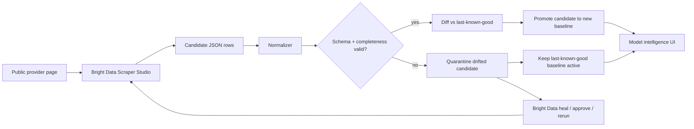

# SpecShift Architecture

## Reliability model

SpecShift treats scraped output as an **untrusted candidate snapshot** until it passes normalization and validation. A page fetch succeeding is not enough to replace the data developers see.



This is intentionally different from a conventional scraper dashboard that simply displays whatever the most recent run returned.

## Data trust states

Each provider is tracked independently.

| State | Meaning | Data shown to user |
| --- | --- | --- |
| `setup` | Collector/token not configured | Clearly labeled demo preview |
| `idle` | Collector configured, no live scan this browser has seen | Preview or previous baseline |
| `queued` / `running` | Bright Data collection in progress | Existing baseline remains visible |
| `ready` | Candidate passed validation | Newly promoted live snapshot |
| `drift` | Candidate failed validation/completeness | Last-known-good snapshot; bad candidate is quarantined |
| `cached` | Prior validated snapshot exists locally | Previous validated baseline |
| `error` | Trigger/polling failed | Previous baseline remains visible |

## Last-known-good promotion rule

A candidate can replace the baseline only if:

1. The collection resolves to a structured array.
2. Required model identity/provenance fields are valid.
3. Numeric invariants are sane (for example, no negative prices or non-positive context limits).
4. Snapshot completeness meets the validation threshold.

If those checks fail, SpecShift reports drift and **does not overwrite the prior good snapshot**.

The browser persists the last validated snapshot for each provider under a namespaced local-storage key. This is a lightweight hackathon implementation of a pattern that would move to durable server-side storage in production.

## Change detection

After a valid candidate arrives, SpecShift compares it against the prior validated snapshot and emits deterministic deltas for:

- model added;
- model removed;
- input price changed;
- output price changed;
- context limit changed;
- availability/lifecycle changed.

Only validated candidates enter this diff path, preventing scraper drift from being misreported as a real provider/product change.

## Bright Data boundary

The browser never receives the Bright Data API token.

```text
React browser
   │
   ├─ POST /api/collectors/run
   │        │
   │        └─ server → Bright Data /dca/trigger (Bearer token)
   │
   └─ GET /api/collectors/result?provider=...&collectionId=j_...
            │
            └─ server → Bright Data /dca/dataset (Bearer token)
```

Stable non-secret `c_*` Collector IDs are server environment variables. Per-run `j_*` collection IDs may be returned to the browser for polling and provenance.

## Provenance and honesty

SpecShift deliberately distinguishes:

- **Live via Bright Data** — all configured sources shown from successful validated live collections.
- **Mixed live + baseline** — at least one source is live while others use cached/preview data.
- **Live ready · preview data** — collectors are configured but no live scan has completed in the current state.
- **Labeled demo preview** — no live runtime is configured.

Demo records never masquerade as live scrape output.

## Self-healing proof

Bright Data healing is intentionally performed through the official CLI rather than hidden behind a fake browser button:

```text
create → run → observe failure → heal → review → approve → rerun
```

The critical evidence is that the same stable `c_*` Collector ID is used before and after repair. See `docs/BRIGHT_DATA.md` for the exact commands and three custom collector prompts.
